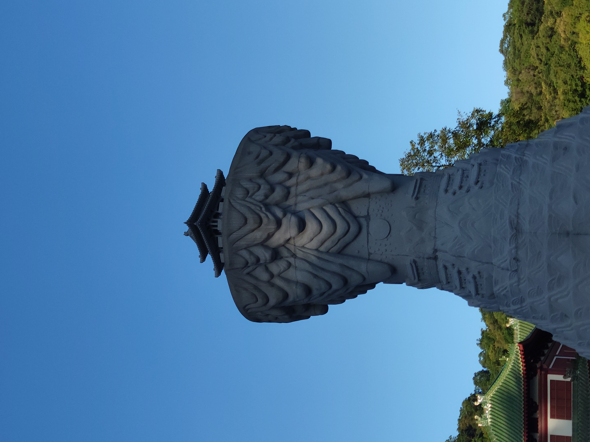

你好，世界！你好，世界！你好，世界！你好，世界！你好，世界！你好，世界！你好，世界！你好，世界！你好，世界！

你好


--- 

$$ \sum_{i=1}^{100}i = 5050 $$


$$
\begin{align*}
y = y(x,t) &= A e^{i\theta} \\
&= A (\cos \theta + i \sin \theta) \\
&= A (\cos(kx - \omega t) + i \sin(kx - \omega t)) \\
&= A\cos \frac{2\pi}{\lambda} (x - v t) + i A\sin \frac{2\pi}{\lambda} (x - v t)
\end{align*}
$$

---

```python
print("hello world")
```

- apple
- banana
- orange
- pear

> reference

this is a link : [baidu](https://www.baidu.com)


